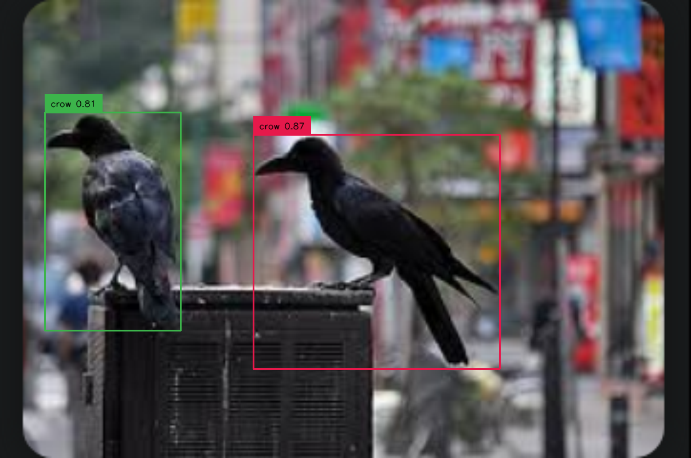
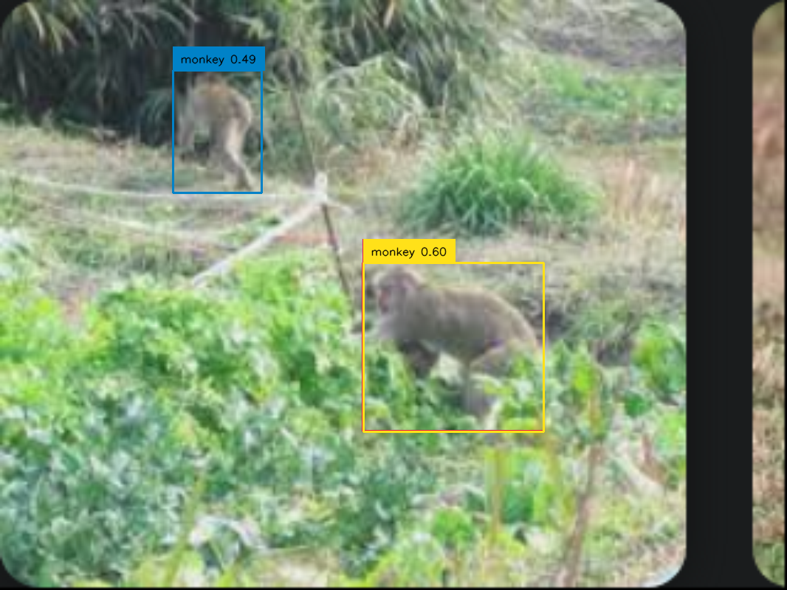
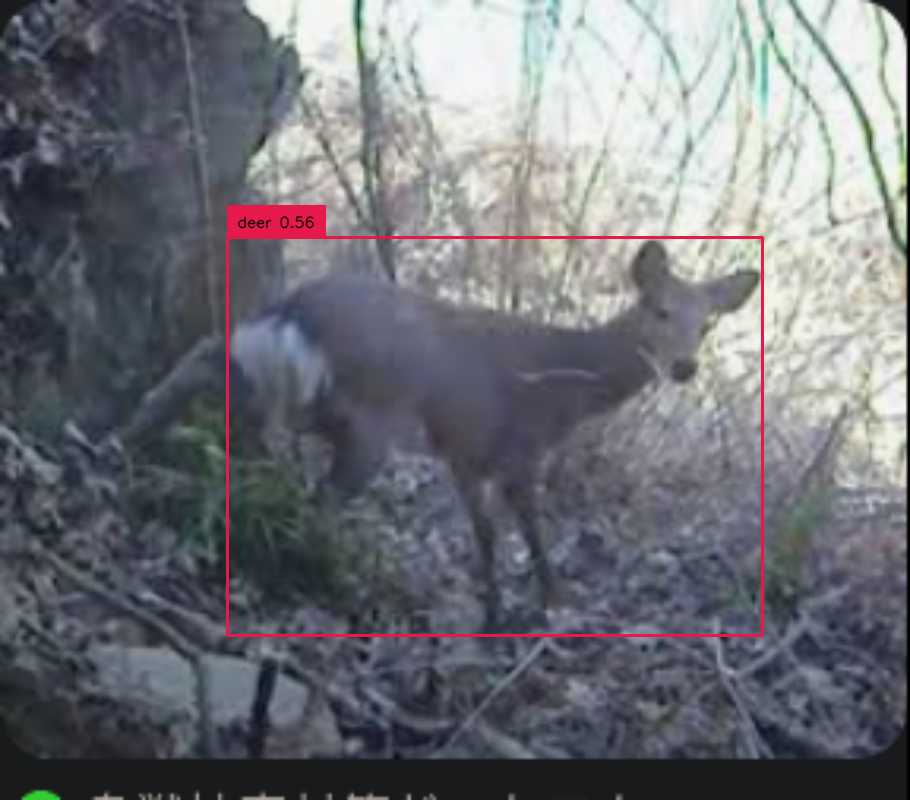
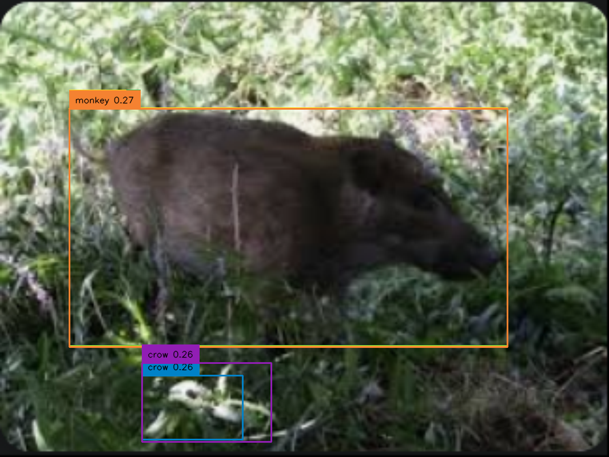

市販の対策用製品をohana-robotにくっつけてみるのはいかがだろう．
大規模な酪農家や果樹農家は，周りを電気柵で囲うとか[モンスターウルフ](https://www.wolfkamuy.com/) 等の製品を使えば良い．
あなた自身がハンターになって，狩りをするのも良いだろう．  
ネットを使うのもそこそこ有効だ．
統合的な対策方法を組み合わせることが基本である．

小さい畑と大きい畑で方法も違うだろうし，近所迷惑になるならない，被害の程度によっても異なるだろう．
唯一の正解はないし，どの場合でも完全な対策方法なぞ今のところないのだから，いっそのこと「遊び」方向に走るのは悪くない．
2で示したスピーカとライトを使って，音と光で追い払う方法を真面目に考えてみよう．  

カラスの悲鳴や犬・狼の鳴き声，人間の声，銃声など，Youtubeで [カラスの嫌がる音声](https://www.youtube.com/watch?v=V8zPwXS5NMw)と調べるといくつか出てくる．
これをループ再生しても良い．  
あるいはサンプリングしておいて，それらを[SEQTRAK](https://jp.yamaha.com/products/music_production/music-production-studios/seqtrak/index.html) 
で無限パターンのリズムを作る．
さらに，レーザーポインタ・ライト等を組み合わせておくと，立派なものにはなるのではないか．
ライトの有無は大きいそうだ．

スピーカだと指向性が無くて近所迷惑になりそうなので，[メガホンスピーカ](https://www.amazon.co.jp/%E3%83%9D%E3%83%BC%E3%82%BF%E3%83%96%E3%83%AB%E3%83%A1%E3%82%AC%E3%83%9B%E3%83%B3%E3%82%B9%E3%83%94%E3%83%BC%E3%82%AB%E3%83%BC-PA-%E6%8B%A1%E5%A3%B0%E5%99%A8%E3%80%81%E5%A4%A7%E9%9F%B3%E9%87%8F%E5%85%85%E9%9B%BB%E5%BC%8F%E3%82%B5%E3%83%9D%E3%83%BC%E3%83%88-300-%E7%A7%92%E9%8C%B2%E9%9F%B3%E3%83%A1%E3%82%AC%E3%83%9B%E3%83%B3%E3%80%81%E3%82%A2%E3%82%A6%E3%83%88%E3%83%89%E3%82%A2%E3%82%B9%E3%83%9D%E3%83%BC%E3%83%84%E3%80%81%E3%83%81%E3%82%A2%E3%83%AA%E3%83%BC%E3%83%87%E3%82%A3%E3%83%B3%E3%82%B0%E3%83%95%E3%82%A1%E3%83%B3%E3%82%B3%E3%83%BC%E3%83%81%E7%94%A8/dp/B0CHQWZ8S7)使っても良いかもですね．

### カラス・シカの検出

Grounding DINOを用いてできる．カラスだけとか，種が限定されているならばもっと軽量モデルでも良い．
ロボットに搭載する場合，

  

    
  

  

    
  

  

    
  

  

    
  

### 忌避音サンプリング

### レーザとの連携

### 実験

動物が慣れるまで有効．
